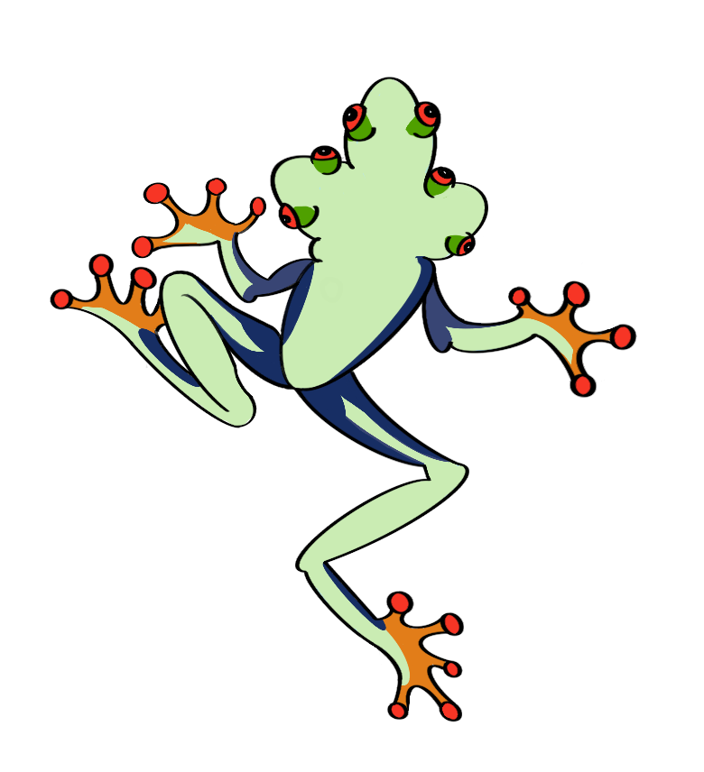

 

# HydrAMP: a deep generative model for antimicrobial peptide discovery

[](https://zenodo.org/badge/latestdoi/452699400)
### Data

Data is available via [DVC](https://dvc.org/) and can be obtained by running  following commands within repo root directory:

```
pip install dvc[gdrive]
dvc pull
```
This puts all data in appropriate directories, which makes code ready-to-be-run. You can also request specific directories/files. Please see [dvc pull doc](https://dvc.org/doc/command-reference/pull). You will be prompted to your Google account for access.

DVC ensures data version is paired with code. Alternatively, you can download data directly through [Google Drive](https://drive.google.com/drive/folders/1IwJjwSKpXYWWALKXM8nghqmlSvyu3BYq?usp=sharing). 

#### Available data: 
- data - training data for peptides < 25 AA (16.8 MB)
- models - checkpoints of HydrAMP, PepCVAE, and Basic models for every training epoch (466 MB)
- results - dumped generation results for every model. Required for running comparison notebooks (832 MB)
- wheels - custom TensorFlow packages (1 GB). See [Required software](#required-software) below. 


### Required software

HydrAMP was tested under Linux and Windows running python 3.8. Other python versions might work as well but it is not guaranteed. All required packages are enclosed in `setup.py`. Run:

```console
pip install .
```

to install HydrAMP and other required packages. This should take up to 10 minutes with 50Mbps internet.


If you plan to retrain HydrAMP, you are going to need custom TensorFlow wheels that have some cherry-picked bug fixes. It is not possible to use TensorFlow version where these bugs are fixed since API changed significantly (Keras-Tensorflow side) and this would require to rewrite training code. These wheels can be found under  in `wheels/` via DVC


### How to generate peptides with HydrAMP

Interface for generating peptides is enclosed in `HYDRAmpGenerator` class. Latest model can be found under `models/HydrAMP/37`  and latest decomposer can be found under `models/HydrAMP/pca_decomposer.joblib`.  You can find useful scripts under `amp/inference/scripts`.

Initialize object with path to model and decomposer:

```python
from amp.inference import HydrAMPGenerator

generator = HydrAMPGenerator(model_path, decomposer_path)
```

The package provides 2 modes for peptide generation:

- **analouge generation** - use existing peptides as starting points to find new AMPs 
```python
def analogue_generation(self, sequences: List[str], seed: int,
                    filtering_criteria: Literal['improvement', 'discovery'] = 'improvement',
                    n_attempts: int = 100, temp: float = 5.0, **kwargs) -> Dict[Any, Optional[Dict[str, Any]]]:
```
>*Parameters:*
>
>`sequences` - list of peptide sequences to process
>
> `filtering_criteria` - 'improvement' if generated peptides should be strictly better than input sequences (higher
        P(AMP), lower P(MIC) in case of positive generation);
        'discovery' if generated sequences should be good enough but not strictly better
>
> `n_attempt` - how many times a single latent vector is decoded 
>
> `seed` - seed for reproducible results 
> 
> `**kwargs` - additional boolean arguments for filtering. See [filtering options](#filtering-options)
>
> `temp` - creativity parameter. Controls latent vector sigma scaling
>
> *Returns:*
>
> `res` - dict of dicts, keys corresponds to original sequences, values are dicts with the following fields:
> - **mic** - probability of low mic
> - **amp** - probability of high amp
> - **length** - length of sequence
> - **hydrophobicity**
> - **hydrophobic_moment**
> - **charge**
> - **isoelectric_point**
>
> and 
> - **generated_sequences** - list of generated and filtered sequences, each described with a dict as above

#### Example call (try to improve Pexiganan and Temporin A with 100 attempts and a default temperature)

```python
# exemplary method call for Pexiganan and Temporin A (generated sequences were truncated)
>> generator.analogue_generation(sequences=['GIGKFLKKAKKFGKAFVKILKK' 'FLPLIGRVFSGIL'],
                                 filtering_criteria='improvement',
                                 n_attempts=100)

{'FLPLIGRVLSGIL': {'amp': 0.9999972581863403,
                   'charge': 1.996,
                   'generated_sequences': [{'amp': 0.9998811483383179,
                                            'charge': 1.996,
                                            'hydrophobic_moment': 0.5703602534454862,
                                            'hydrophobicity': 0.6307692307692307,
                                            'isoelectric_point': 10.7421875,
                                            'length': 13,
                                            'mic': 0.8635282516479492,
                                            'sequence': 'FLPLIGRVLPGIL'}],
                   'hydrophobic_moment': 0.5872424608996596,
                   'hydrophobicity': 0.6076923076923078,
                   'isoelectric_point': 10.7421875,
                   'length': 13,
                   'mic': 0.936310887336731},
 'GIGKFLKKAKKFGKAFVKILKK': {'amp': 1.0,
                            'charge': 9.994,
                            'generated_sequences': [{'amp': 1.0,
                                                     'charge': 9.994,
                                                     'hydrophobic_moment': 0.7088747699407729,
                                                     'hydrophobicity': -0.05090909090909091,
                                                     'isoelectric_point': 11.576171875,
                                                     'length': 22,
                                                     'mic': 0.011877596378326416,
                                                     'sequence': 'GIGKFLKKAKKFGKAFVKILKK'},
                                                    {'amp': 1.0,
                                                     'charge': 8.994,
                                                     'hydrophobic_moment': 0.6008331010319634,
                                                     'hydrophobicity': 0.07181818181818182,
                                                     'isoelectric_point': 11.5185546875,
                                                     'length': 22,
                                                     'mic': 0.010871708393096924,
                                                     'sequence': 'GIGKFLKKAKFLGKAFVKIFKK'}],
                            'hydrophobic_moment': 0.7088747699407729,
                            'hydrophobicity': -0.05090909090909091,
                            'isoelectric_point': 11.576171875,
                            'length': 22,
                            'mic': 0.01187763549387455}}

```

- **unconstrained generation** - allows to sample new peptides from encoded latent space
```python    
def unconstrained_generation(self,
                             mode: Literal["amp", "nonamp"] = 'amp',
                             n_target: int = 100,
                             seed: int = None,
                             filter_out: bool = True,
                             properties: bool = True,
                             n_attempts: int = 64,
                             **kwargs) -> Union[List[Dict[str, Any]], List[str]]:
```


> *Parameters:* 
>
>`mode` - str, "*amp*" or "*nonamp*", default: "*amp*"
>
> `n_target` - how many peptides should be succesfully sampled
>
> `seed` - seed for reproducible results
>
> `filter_out` - uses AMP and MIC classifier information to filter sequences that were predicted to not be from desired class
> 
> `properties` - if True, each sequence  is a dictionary with additional properties
>
> `n_attempt` - how many times a single latent vector is decoded 
>
> `**kwargs` - additional boolean arguments for filtering. See [filtering options](#filtering-options)
>*Returns:*
>
> `res` - list of dicts, each dict correspond to single sequence described with same fields as in template generation. 
> 

```python
# exemplary method call, request 2 amp sequences without properties

>> generator.unconstrained_generation(n_target=2, mode="amp", properties=False)

['FRMSLAWKCLLL', 'GLLGGLLKRRRFVR']

# exemplary method call, request 2 amp sequences with properties

>> generator.unconstrained_generation(n_target=2, mode="amp", properties=True)

[{'amp': 0.9997017979621887,
  'charge': 2.928,
  'h_score': 1.4285714285714284,
  'hydrophobic_moment': 0.1713221131786216,
  'hydrophobicity': 0.31500000000000006,
  'isoelectric_point': 10.03125,
  'length': 12,
  'mic': 0.017575599253177643,
  'sequence': 'FRMSLAWKCLLL'},
 {'amp': 0.9999890327453613,
  'charge': 5.996,
  'h_score': 1.1794871794871795,
  'hydrophobic_moment': 0.2868787441416022,
  'hydrophobicity': -0.24000000000000002,
  'isoelectric_point': 12.58447265625,
  'length': 14,
  'mic': 0.06286950409412384,
  'sequence': 'GLLGGLLKRRRFVR'}]

```

### Retraining HydrAMP and its ablated version as well as classifiers

You can find notebooks for retraining all models under `scripts/`. This includes `{hydra, pepcvae, basic}_training_procedure.ipynb` and `{amp, mic}_classifier_training_procedure`. Training a single model takes about 14h on NVIDIA RTX 2080 and a 2.4GHz CPU with total of 32 threads. 


### Filtering options

The following are additional filtering:

- **filter_hydrophobic_clusters** -  do not allow 3 hydrophobic aminoacids in a row
- **filter_repetitive_clusters** - do not allow the same aminoacid repetead 3 times in a 5-sized window
- **filter_cysteins** - filter peptides with cysteins
- **filter_known_amps** - remove all generated peptides that were found in databases
